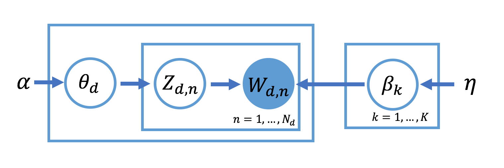
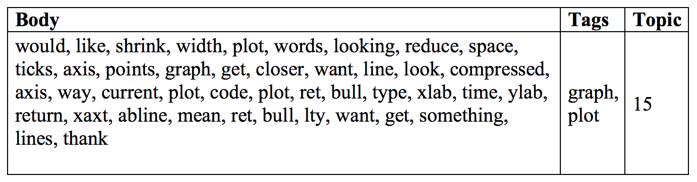
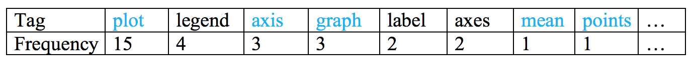
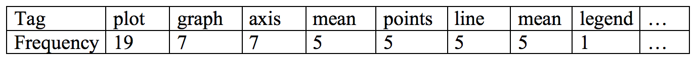
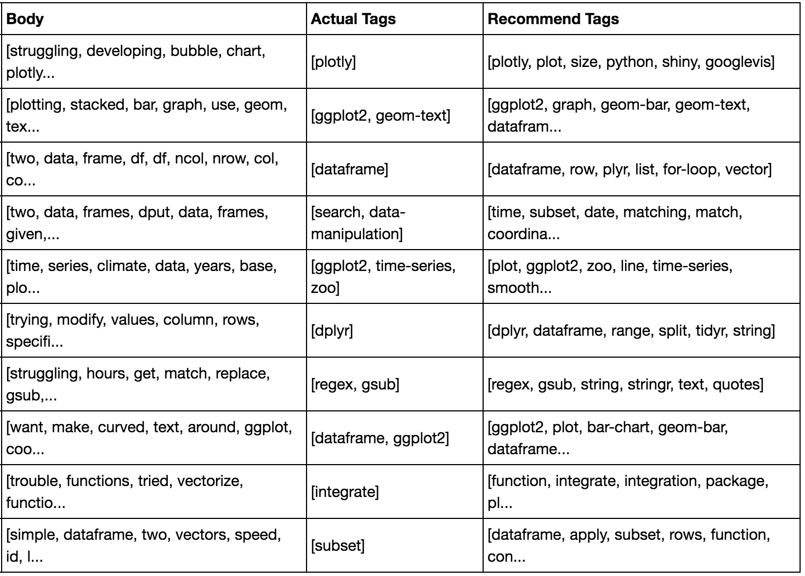

# Tag-Recommendation-System

 
 

#### Topic Modeling

**Latent Dirichlet Allocation (LDA)** is a Bayesian technique that is widely used for inferring the topic structure in corpora of documents. In LDA, a document can be represented as a mixture of $K$ topics, and every topic has a discrete distribution over words.

The generative process is:

1. For $k = 1$ to $K$,
    + Choose topic $\beta_k \sim \text{Dir}(\eta)$, where $\beta_k$ is a $V$-dimensional probability distribution on the $V$ words for topic $k$
2. For each document $d$ in corpus $D$,
    + Choose a topic distribution $\theta_d \sim \text{Dir}(\alpha)$, where $\theta_d$ is a $K$-dimensional probability distribution on the topics for document $d$
    + For each word index $n$ from 1 to $N_d$,
        + Choose a topic $z_{d,n} \sim \text{Discrete}(\theta_d)$
        + Choose word $w_{d,n} \sim \text{Discrete}(\beta_{z_{d,n}})$

#### Tag Recommendation

The recommender system is built by combining the fitted `LDA model`, `user-based collaborative filtering (KNN)` and `content-based filtering`.

Example:

Here is the cleaned text of a question in test set.

 
The LDA model classified 5206 questions in training set to topic 15. First, find 20 questions that are most similar to the untagged question.

The similarity of two questions given by `Jaccard Index`

$$J(A,B) = \frac{|A \cap B|}{|A \cup B|}$$

 
Count tags of these questions.

 
The tags marked blue above table appear in the body of question, so we increase the frequency of these tags, then sort the tags again.

 
Finally, recommend the top 6 tags to this question.

 
Repeat this process for whole test set, the accuracy of recommend correct tags is `73%`.

